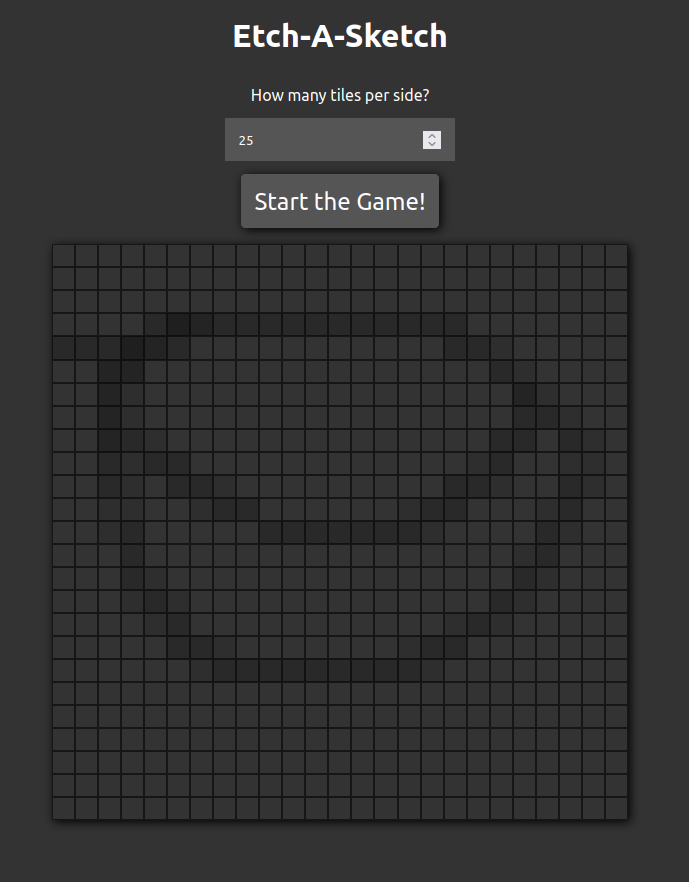

# The Odin Project - Etch-A-Sketch

## What is this?

A simple Etch-A-Sketch game written in HTML, CSS and JavaScript, with increasing opacity of 10% per mouseover, until the field is fully black and choice of tiles from 1 - 100.
Based on the "The Odin Project" Foundation curriculum found [here](https://www.theodinproject.com/paths/foundations/courses/foundations/lessons/etch-a-sketch-project).

## Image

